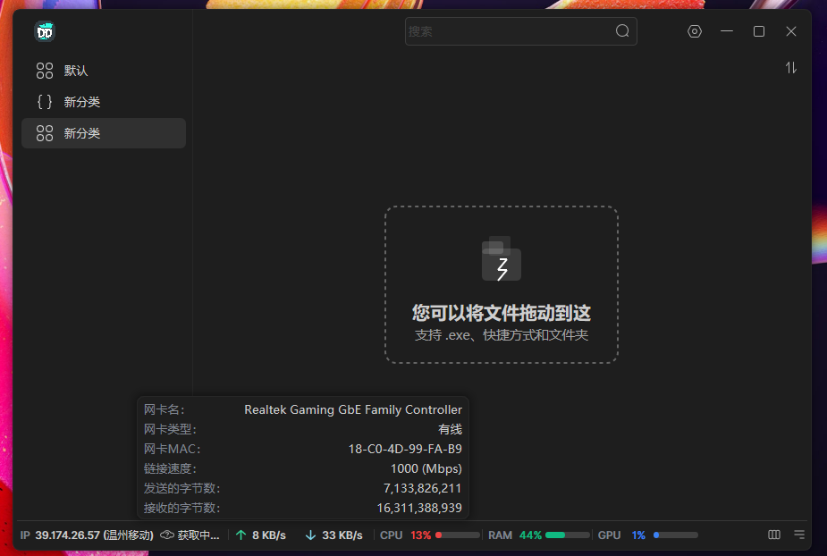
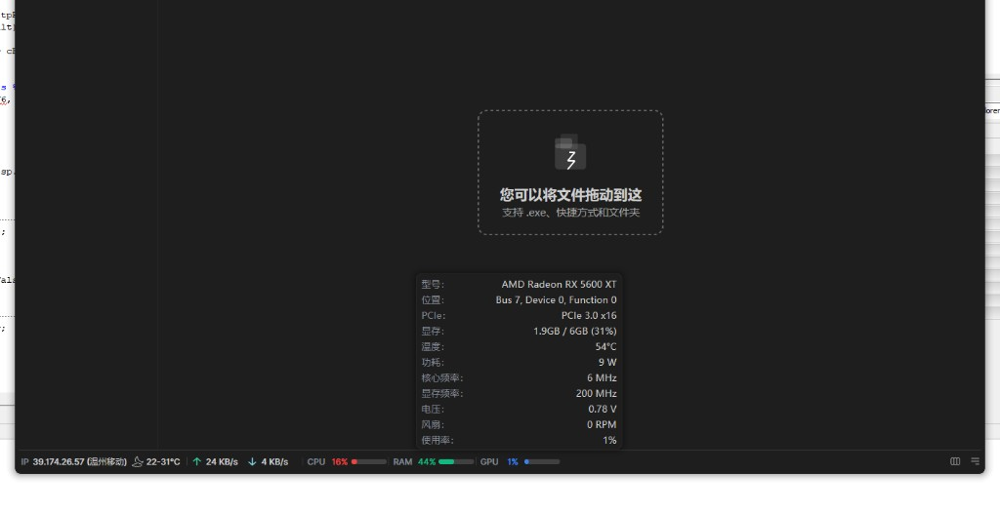
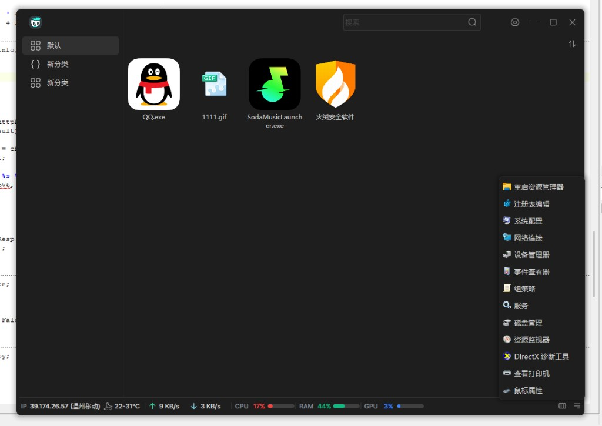
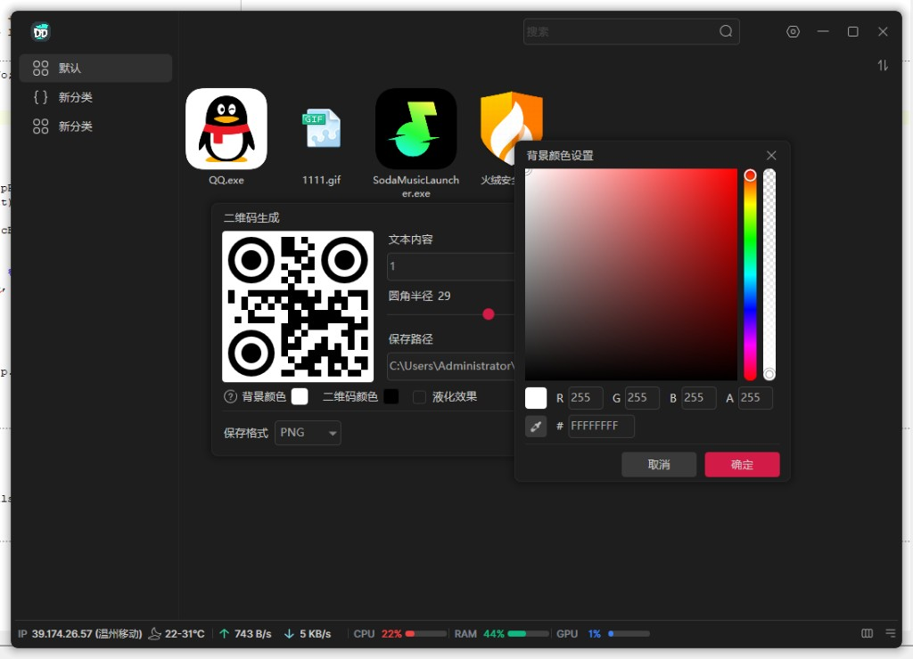
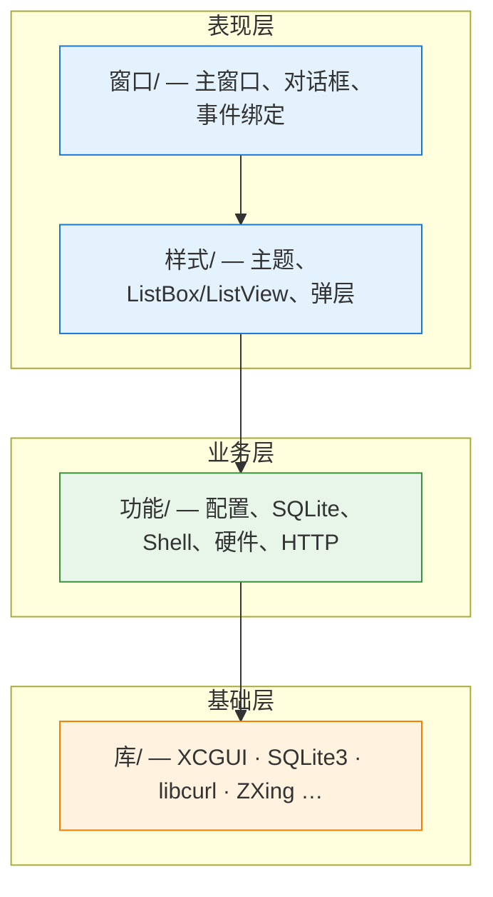
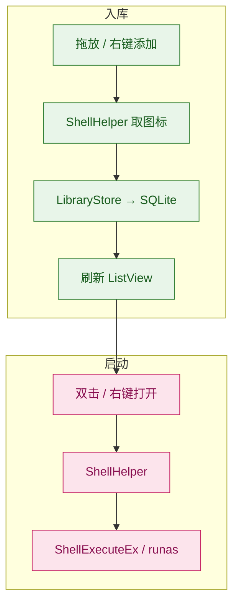
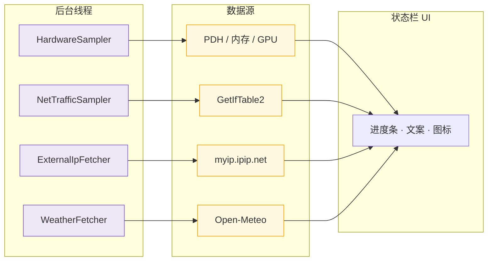
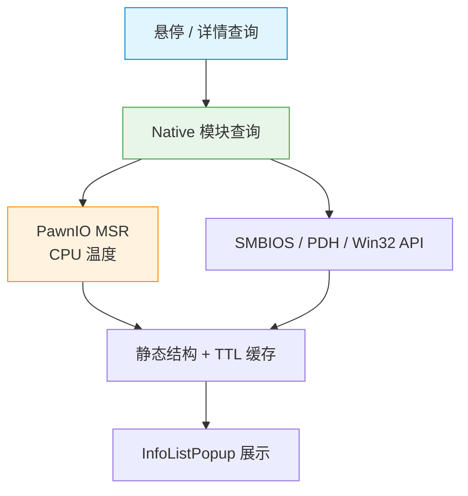

# 游戏菜单 · QDesktop

**Windows 桌面快捷方式启动器** — Delphi XE2 32 位 · xcgui 自绘界面

## 运行告示

> **演示程序已经放在 `Debug` 文件夹内**
>
> 进入 `Debug/Win32/` 或 `Debug/Win64/`，双击 `QDesktop.exe` 即可运行（无需安装 Delphi、无需先编译）。

## 目录

- [运行告示](#运行告示)
- [快速了解](#快速了解)
- [界面预览](#界面预览)
- [软件原理](#软件原理)
  - [技术栈](#技术栈)
  - [分层架构](#分层架构)
  - [界面机制](#界面机制)
  - [入库与启动](#入库与启动)
  - [状态栏与后台](#状态栏与后台)
  - [硬件信息](#硬件信息)
  - [HTTP 与配置](#http-与配置)
- [目录结构](#目录结构)

---

## 快速了解

| | |
| :--- | :--- |
| **定位** | 按分类管理程序 / 文件夹 / 快捷方式，拖放入库、一键启动 |
| **数据** | SQLite `games.db` + `QDesktop.ini` |
| **状态栏** | 外网 IP、天气、网速、CPU / 内存 / GPU 实时占用 |
| **运行目录** | 见上文 [运行告示](#运行告示) |

---

## 界面预览

<table>
<tr>
<td width="50%" valign="top">

#### 主界面 · 拖放入库

左侧分类、右侧启动项网格。支持将 `.exe`、快捷方式、文件夹拖入空白区域入库。

</td>
<td width="50%" valign="top">

</td>
</tr>
<tr>
<td width="50%" valign="top">

</td>
<td width="50%" valign="top">

#### 状态栏 · 硬件详情

底部显示外网 IP、天气、网速及 CPU / 内存 / GPU；悬停查看网卡、显卡等详情。

</td>
</tr>
<tr>
<td width="50%" valign="top">

#### 启动项 · 系统工具

分类管理常用程序；右键可打开注册表、设备管理器、服务、磁盘管理等。

</td>
<td width="50%" valign="top">

</td>
</tr>
<tr>
<td colspan="2" align="center">

#### 二维码生成

内置生成器：圆角、颜色、液化效果，支持导出 PNG。

</td>
</tr>
</table>

---

## 软件原理

QDesktop 将启动项按**分组**组织：左侧选分类，右侧点图标即可启动；支持拖放入库、全库搜索、右键编辑，以及状态栏展示网络、硬件、外网 IP 与天气。

### 技术栈

| 项 | 说明 |
| :--- | :--- |
| 语言 / 位宽 | Delphi XE2，**32 位（WOW64）** |
| UI 框架 | [xcgui](库/XCGUI/) — XML 布局 + 自绘控件，GDI / D2D |
| 数据 | SQLite（`games.db`）分组 + 启动项 |
| 配置 | `QDesktop.ini` — 路径、窗口位置、采样开关等 |
| 单实例 | 命名互斥量；重复启动时激活已有窗口 |

**启动顺序**

### 分层架构

| 层 | 职责 |
| :--- | :--- |
| **窗口** | 绑 XML 名 → 注册事件 → 调功能层，不写重业务 |
| **样式** | 可复用控件外观，颜色来自 `UI_Theme.pas` |
| **功能** | 不依赖具体窗口，供多处复用 |
| **库** | DLL / API 声明，无业务逻辑 |

### 界面机制

1. **布局** — `Resource/Layout/*.xml`（源稿 `Debug/Win32/Resource/Layout/`，Win64 同步），`XC_GetObjectByName` 关联控件。
2. **绘制** — 样式单元注册 `XE_*` 回调；D2D 需 `XC_IsEnableD2D` 与 DPI 坐标转换。
3. **列表虚表与图标** — `FItems` 为数据源、绘制零 IO、虚表用 `XEle_Redraw`（见 [docs/列表虚表与图标.md](docs/列表虚表与图标.md)）。
4. **主题** — 语义色在 `UI_Theme.pas`；窗口 `ApplyDefaultStyles` 仅做 CPU/RAM/GPU 分色。

### 入库与启动

| 概念 | 说明 |
| :--- | :--- |
| **分组** | 名称、图标、条目宽度、排序（名称 / 时间 / 类型，升/降） |
| **条目** | 路径、显示名、图标缓存、启动参数、工作目录 |
| **图标** | 优先 IconCache 流式读取；类型图标独立缓存目录 |

### 状态栏与后台

主窗口 `Init` 中启动后台线程，经回调更新 UI，不阻塞消息循环：

| 线程 | 数据来源 | UI 更新 |
| :--- | :--- | :--- |
| `THardwareSamplerThread` | 系统时间差 / 内存 / PDH GPU | CPU、RAM、GPU 百分比 |
| `TNetTrafficSamplerThread` | `GetIfTable2` 汇总 | 上/下行速率 |
| `TExternalIpFetcherThread` | [myip.ipip.net](https://myip.ipip.net/) | 外网 IP、归属地、运营商 |
| `TWeatherFetcherThread` | HTTP → Open-Meteo | 温度、天气图标、污染物 |

悬停详情（CPU 型号、内存条、网卡 MAC、GPU 显存等）由 `TInfoListPopupUI` 在悬停时按需调用 `CpuInfo` / `MemInfo` / `NetInfo` / `GpuInfo`，不在采样线程中拼接。

### 硬件信息

1. **CPU**：`CpuInfoNative`（CPUID + NT API）+ `CpuInfoPawnIo`（PawnIO MSR）；无温度时回退 `HardwarePdh`（ACPI 热区 PDH）。
2. **内存**：`MemInfoNative`（`GlobalMemoryStatusEx` + SMBIOS Type 16/17）。
3. **GPU**：`HardwarePdh`（PDH 利用率）+ `GpuInfoNative`（`EnumDisplayDevicesW` + D3DKMT/注册表显存，无 COM）+ `GpuInfoVendor`（AMD ADL2 / NVIDIA NVML 传感器/显存）。
4. **网卡**：`GetAdaptersAddresses` + `GetIfEntry2`；传感器字段按 TTL 缓存。

**使用率**（高频）与 **详情 tooltip**（低频）分离：`HardwareMonitor` 刷新百分比，首次悬停详情可能略慢。

### HTTP 与配置

- 所有 HTTP 请求集中在 `功能/网络/NetHttpWorker`（libcurl 同步 GET）。
- `AppConfig` — INI 与路径；`AppSettings` — 选项持久化、GDI/D2D 与绘制频率。

**32 位路径约定**：`System32` → `SysWOW64`；真实 64 位目录用 `Sysnative`；注册表须明确 32/64 视图。

---

## 目录结构

<b>展开完整目录说明</b>

| 目录 | 说明 |
| :--- | :--- |
| `QDesktop.dpr` | 入口：单实例、配置、XCGUI、主布局与消息循环 |
| `窗口/` | 主窗口、设置、编辑项、分类、二维码、取色、提示等 |
| `样式/` | 主题色板、按钮、列表、菜单、弹层、进度条、滚动条 |
| `功能/配置/` | `QDesktop.ini`、GDI/D2D、绘制频率 |
| `功能/数据库/` | SQLite 分组与启动项 |
| `功能/` | Shell 图标、拖放、启动执行、打开方式 |
| `功能/硬件/` | 状态栏采样、PawnIO MSR / SMBIOS / PDH 硬件详情 |
| `功能/硬件/CPU/` · `Mem/` · `GPU/` · `Net/` | 各硬件详情与网速 |
| `功能/网络/` | libcurl（`NetHttpWorker`）、后续多线程下载等 |
| `功能/天气IP/` | 外网 IP、天气解析 |
| `库/XCGUI/` | 炫彩界面库 Delphi API |
| `库/SQLite3/` | SQLite C API（[stijnsanders/TSQLite](https://github.com/stijnsanders/TSQLite)，sqlite.h 3.51.3）+ `SQLite3Wrap` |
| `库/libcurl/` | libcurl Pascal 绑定（运行时 DLL 在 `Debug/Win32/Bin/` 或 `Debug/Win64/Bin/`） |
| `库/ZXingQRCode/` | 二维码生成 |
| `Debug/Win32/` · `Debug/Win64/` | 编译输出：`QDesktop.exe`、`Bin/`、`Resource/`、`Data/` |
| `Debug/*/Resource/Layout/` | 界面布局 XML |
| `Debug/*/Data/` | `games.db`、图标缓存、`QDesktop.ini`、`city.json`（城市经纬度） |
| `docs/` | [列表虚表与图标](docs/列表虚表与图标.md) |

业务代码经 `样式/`、`功能/` 访问 `库/`，避免在 `窗口/` 直接散落底层调用。

---

文档随目录维护 · 新增子目录请在上表补充说明

